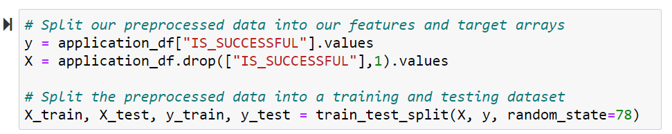
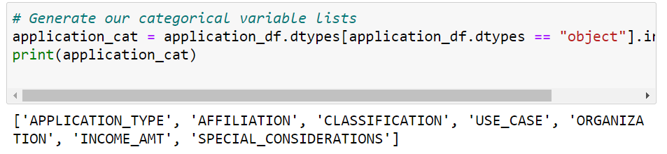
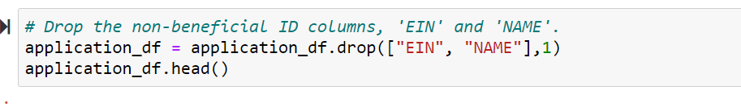
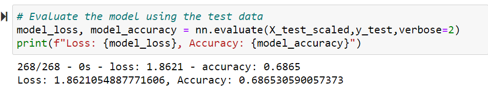

# Neural_Network_Charity_Analysis

## Overview
The purpose of this projetc is to use Neural Networks to predict the companies that can be funded by Alphabet Soup.

## Result
### Data Processing

 - What variable(s) are considered the target(s) for your model?

 

 - What variable(s) are considered to be the features for your model?
  
 

 - What variable(s) are neither targets nor features, and should be removed from the input data?

 

### Compiling, Training, and Evaluating the Model

 - How many neurons, layers, and activation functions did you select for your neural network model, and why?
2 Hidden layers. 

 - Were you able to achieve the target model performance? No!

 

 - What steps did you take to try and increase model performance?
Changed hidden layers and it changed the performance from 0.52 to 0.68. 

## Summary
With dropping extra columns and changing and adding hidden layers the accuray could not reach higher than 68%. Which make us think using other models than Neural Networks, and get a better prediction accuray. So the data would be more trustable to be used and fund companie based on the result.

